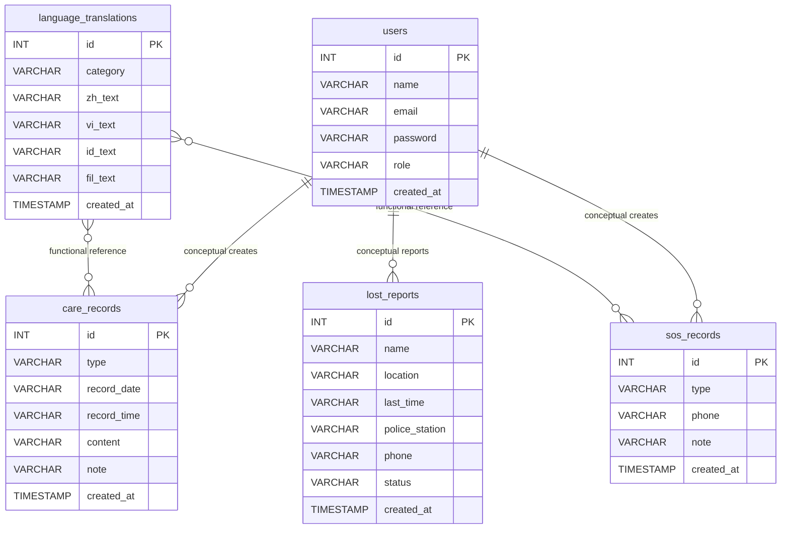

# CareTranslateAI v2.5 ER Model

依據檔案：

- `src/main/resources/sql/caretranslate_db.sql`
- `src/main/java/model/*.java`
- `src/main/java/dao/impl/*.java`

## 重要說明

此專案目前 SQL 共有 5 張資料表：

1. `users`
2. `language_translations`
3. `care_records`
4. `sos_records`
5. `lost_reports`

目前 SQL 只有設定 `PRIMARY KEY`，沒有設定 `FOREIGN KEY`。因此 ER 圖中的 `users` → `care_records`、`sos_records`、`lost_reports` 使用「虛線概念關聯」表示，代表這是系統功能上合理的關係，但目前資料庫尚未以 `user_id` 實作。

## Mermaid ER Diagram



## 建議升級成正式資料庫關聯

若要讓畢業專題更完整，建議修改：

```sql
ALTER TABLE care_records ADD COLUMN user_id INT;
ALTER TABLE sos_records ADD COLUMN user_id INT;
ALTER TABLE lost_reports ADD COLUMN user_id INT;

ALTER TABLE care_records
ADD CONSTRAINT fk_care_records_user
FOREIGN KEY (user_id) REFERENCES users(id);

ALTER TABLE sos_records
ADD CONSTRAINT fk_sos_records_user
FOREIGN KEY (user_id) REFERENCES users(id);

ALTER TABLE lost_reports
ADD CONSTRAINT fk_lost_reports_user
FOREIGN KEY (user_id) REFERENCES users(id);
```
